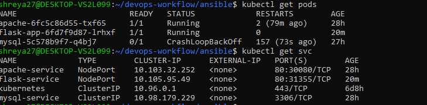
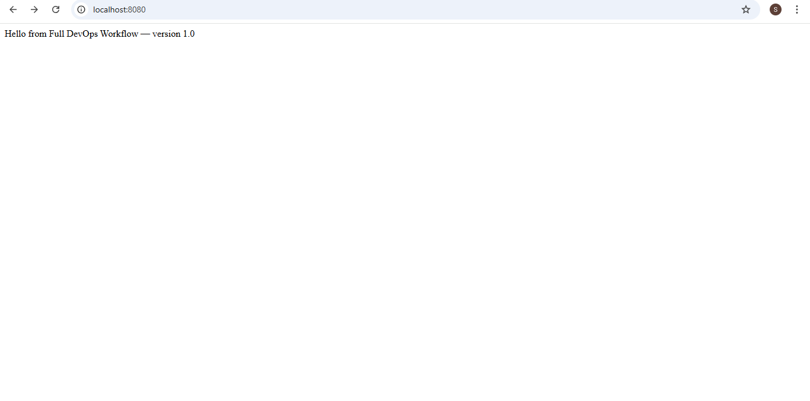

# CI/CD Workflow with Jenkins + Ansible + Docker + Kubernetes

In this project, I implemented a complete CI/CD workflow integrating **Jenkins**, **Ansible**, **Docker**, and **Kubernetes**.  
The aim was to automate the process from **code commit** to **application deployment** on a Kubernetes cluster,  
simulating a real-world DevOps pipeline that ensures faster, reliable, and repeatable deployments.

## What Was Done

- Set up a **Jenkins pipeline** to automate build and deployment.
- Containerized the application using **Docker**.
- Created **Ansible playbooks** to automate Docker image deployment to Kubernetes.
- Defined **Kubernetes manifests** for deployment and services.
- Verified application running inside Kubernetes via browser access.

## Folder Structure

DevOps-Workflow/

- **ansible/**
  - templates/
    - deployment.yaml.j2
  - hosts
  - playbook.yml

- **app/**
  - Dockerfile
  - app.py
  - requirements.txt

- **jenkins/**
  - Jenkinsfile

- **k8s/**
  - flask-deployment.yaml
  - flask-service.yaml

## How It Works

1. **Code Commit** → Developer pushes code to GitHub.
2. **Jenkins Build** → Jenkins pipeline is triggered, builds the Docker image.
3. **Push to Registry** → The Docker image is stored in a local registry or tagged for deployment.
4. **Ansible Deploy** → Ansible playbook pulls the Docker image and applies Kubernetes manifests.
5. **Kubernetes Service** → Kubernetes creates pods and exposes the service for external access.
6. **Verification** → Application is accessed in the browser to confirm deployment.

## Screenshots

Below are the actual screenshots captured during the process, showing each important stage of the workflow:

| Screenshot | Description |
|------------|-------------|
|  | Kubernetes Pods and Services — Shows running pods and services. |
|  | Browser output confirming the Flask app is running inside Kubernetes. |

## Conclusion

This project demonstrates the integration of **Jenkins**, **Ansible**, **Docker**, and **Kubernetes** into a unified CI/CD pipeline.  
It automates the journey from source code to a fully deployed application, reinforcing practical skills in orchestration, containerization, and automation.

